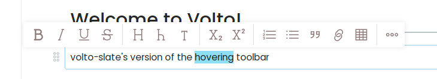
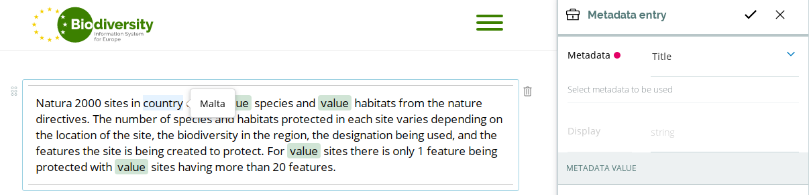
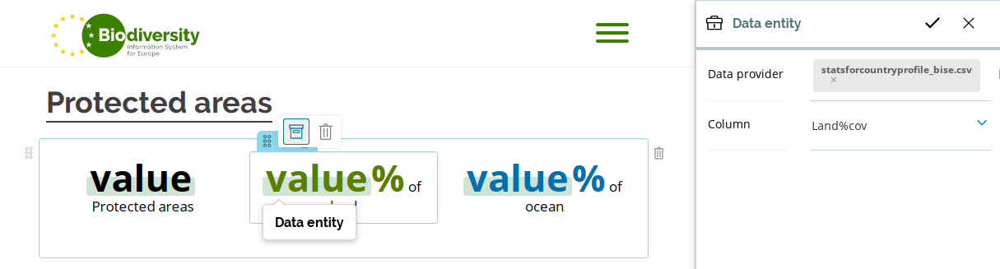
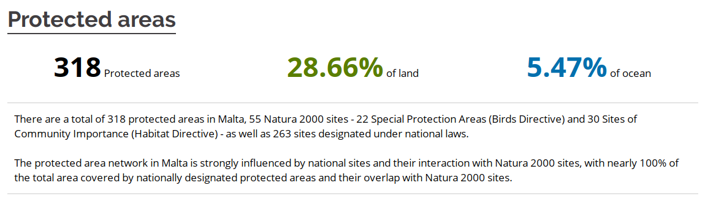

---
class:
  - invert
headingDivider: 2
theme: gaia
style: |
  section {
  }
---

# volto-slate
<!-- _class: lead invert -->

<!--
Hi! My name is Tiberiu Ichim, I'm a Plone/Volto developer working with
Eaudeweb Romania. I'm a core Volto contributor and I've been developing
websites with Volto for a little more then a year.

We've been working this summer for a new Volto-powered website, the
Biodiversity Information System for Europe and volto-slate is one of the
many Open-Source products that were developed as part
of that project.
-->


## We replace Volto's line text editor
<!-- _class: lead invert -->



Works as a drop-in replacement.
Replicates Volto's default editor.

<!--
volto-slate is a replacement for the default rich text line editor, the one that's used for the text blocks.
This is important, it is not a replacement of the whole Volto Pastanaga composite page
editor, just for the "paragraph" editor.

When you install volto-slate, by default it's not very different to Volto's built-in editor.
Sure, it has a few more buttons (too many!), but it looks and feels more or less just
like the default.

Underneath, though, there's a lof of power. Some things to consider first,
before continuing...
-->


## ~~HTML document~~ <br/> ❤︎ modern document

<!-- _class: lead invert -->

<!--
Volto is a big evolutionary step for Plone not just because it integrates with
the latest of the frontend development world, but also because it allows us to
work with concepts and solutions that were not in our reach as Plone developers.

Before Volto we didn't consider the richtext editor as one of the special building
blocks of an application. But the Pastanaga composite page editor places it
right in our face: here's your text, add anything to it and you can build your
page around it.

That's a huge potential just waiting for us. So...
-->

## Don't stop at HTML

<!-- _class: lead invert -->

We can use live React components in the richtext editor.
Why settle for static text?


## volto-slate-metadata-mentions



<!--
I'm going to show you just two small examples of the potential that this
brings.

This is a product that allows you to insert Dexterity metadata fields in text blocks.
-->

## volto-slate-dataentity



---



<!--

This is a product that provides integration with tabular data coming from CSV
files or a REST-exposed SQL database.

So the editors are able to integrate text with values coming from database or the metadata fields and in the final render, the values will respect the styling given to their placeholder text.

-->


## Live demo


<!--

So, let's look at volto-slate in action and see what are its immediate benefits.

Slate itself is just a library you can use to build an editor,
it doesn't provide a default editor, so naturally volto-slate evolved from
the start as a rich text editor designed to fit Volto.

That means we can do

- split paragraph
- join paragraph
- sublists

- Copy paste!

We understand what Volto is, so we know what type of block you should get when
you copy/paste something, and we provide a framework to extend this
capabilities. Right now, we integrate with two types of Volto blocks:
tables and images, but this is something that's extensible

Really really small details that matter:

- consistent up/down arrow keys behavior
- click in a text box, the cursor will stick to the clicked position

Click in a place in Volto, it will "stick".
You wouldn't believe it, but we broke this several times during development and
had to refactor to get it right.
-->

## Why another text editor?

<!-- _class: lead invert -->

<!--

It's important to clarify the question of: why didn't we use Volto's draftjs
and chose to reimplement its line editor?

-->

## Better plugin framework (1)

With Slate you can easily overload the builtin editor:

```
const withImages = editor => {
  const { isVoid } = editor
  editor.isVoid = element => {
    return element.type === 'image' ? true : isVoid(element)
  }
  return editor
}
```
```
import { createEditor } from 'slate'
const editor = withImages(createEditor())
```

<!--

So, with Slate we get a library that's meant to be used for a custom pluggable
editor, in contrast to draftjs, which only has a single pluggable entry point,
the Composite Decorator.
-->

## Better plugin framework (2)

- **Draft.js** is meant to be integrated directly by an application
  - there's no concept of plugins.
- Volto needs to use **draftjs-plugins** for its plugin system.

<!--
This is also draftjs declared scope, but its API is clunky and the editor and
the underlying ecosystem is buggy.

-->

## Slate has a simple DOM-like storage for its values

```
"value": [
  {
    "children": [
      {
        "text": "The European Commission adopted a "
      },
      {
        "children": [
          {
            "text": "Green Infrastructure Strategy"
          }
        ],
        "type": "b"
      },
      {
        "text": " in 2013 \u201cto promote the deployment of green infrastructure ... areas\u201d"
      },
```

<!--
Slate has a simple DOM-like storage for its values, so we were able to implement the paste support quite easily, as it maps very cleanly to parsed HTML nodes.
-->

## Draftjs:

```
  "blocks": [
    {
      "data": {},
      "depth": 0,
      "entityRanges": [],
      "inlineStyleRanges": [
        {
          "length": 29,
          "offset": 34,
          "style": "BOLD"
        },
      ],
      "key": "37eg5",
      "text": "The European Commission ...",
      "type": "unstyled"
    }
  ],
  "entityMap": {}
```

## volto-slate rendering

```
const _serializeNodes = (nodes) => {
    return (nodes || []).map(([node, path], i) => {
      return Text.isText(node) ? (
        <Leaf path={path} leaf={node} text={node} mode="view" key={path}>
          {node.text}
        </Leaf>
      ) : (
        <Element
          path={path}
          element={node}
          mode="view"
          key={path}
          data-slate-data={node.data ? serializeData(node) : null}
          attributes={
            isEqual(path, [0])
              ? getAttributes
                ? getAttributes(node, path)
                : null
              : null
          }
        >
          {_serializeNodes(Array.from(Node.children(editor, path)))}
        </Element>
      );
    });
  };
```

<!-- And because of the simpler data model, look how simple can be to render the Slate values to their final output: just use traverse the tree and use the original React components. -->

## Current status

- No migrations of any kind
- Right now it's not possible to completely
  remove or replace draftjs out of Volto

<!--
Ok, so here are the bad parts:

- we don't have any migrations of any kind right now, so it's not possible to migrate existing content to it. volto-slate can coexist with Draft on a Volto website.

- Right now it's not possible to completely remove or replace draftjs out of Volto


We already have an HTML parser inside volto-slate, as we use it for the
copy/paste support and the algorithms are very straight forward thanks to the
tree-based storage model. So it was just a matter of "no reason to do it until
now".

-->

## Thank you!

<!-- _class: lead invert -->
